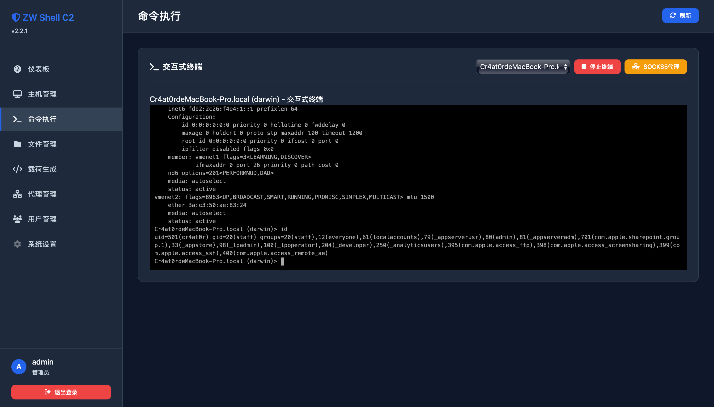

# ZW Shell C2 管理平台功能概览

**版本：v2.2.1**


ZW Shell C2 管理平台是面向红队演练与远程运维场景的 C2 管理系统，主后端使用 Go 实现，默认使用 SQLite，本地即可一键运行。

---

## 核心功能速览

- **主机管理**：实时查看客户端在线状态、标签、备注等信息。
- **命令执行**：下发命令、查看返回结果，支持多系统无依赖执行。
- **代理隧道**：一键启停 SOCKS5 代理，快速搭建隧道。
- **免杀载荷**：生成多平台免杀载荷脚本，支持模板自定义。
- **实时终端**：WebSocket 终端会话，提供交互式 Shell。
- **文件管理**：上传、下载、浏览客户端文件，支持搜索过滤。
- **系统监控**：仪表盘展示在线数量、任务统计、系统日志。

---

## 功能展示
### 1. 登入页面


### 2. 主机管理

- 支持按客户端 ID、标签、在线状态筛选。
- 可查看最近心跳时间、批量清理离线主机。
- 详情页包含系统信息、执行日志入口。

### 3. 命令执行

- 在控制台直接输入命令或选择历史命令。
- 命令状态分为 `pending`/`running`/`success`/`failed`。
- 结果支持长文本展示，并可导出。

### 4. 代理隧道

- 创建 SOCKS5 代理，自动分配或自定义端口。
- 查看连接数、上下行字节数、健康检查结果。
- 支持启停/重启/删除以及批量清理。

### 5. 免杀载荷

- 选择目标平台（Windows/Linux/macOS）。
- 自定义回连地址、混淆参数、输出格式。
- 自带常用免杀技巧模板，可二次扩展。

### 6. 实时终端

- 浏览器内开启交互式 Shell，会话可并行存在。
- 支持调节终端尺寸、超时自动清理。
- 结合 WebSocket 保证低延迟体验。

### 7. 文件管理

- 远程浏览目录结构，快速下载或删除文件。
- 支持上传到客户端指定路径。
- 搜索功能按文件名、客户端 ID 过滤。

---

## 启动与登录

```bash
cd zw-shell-production
# 默认使用 SQLite，无需额外配置
go run .
```

- 访问地址：`http://localhost:7749`
- 默认账号：`admin / admin123`（首次登录后请修改）

---

## 常用配置

- 配置文件：`config/config.yaml`
- 关键项：`server.port`、`database.type`、`auth.default_admin`、`features.*`
- 建议保留 `logs/`、`payloads/`、`evasion_payloads/` 目录，便于日志与载荷落地。

---

## 更新记录

### v2.2.1 (2025-10-9)

- 初始化功能概览文档
- 实现核心 C2 功能：主机管理、命令执行、代理隧道
- 支持多平台载荷生成：Windows/Linux/macOS
- 集成实时终端和文件管理

### v2.2.1 (2025-10-19)
- 删除项目代码文件，等待更新发布


